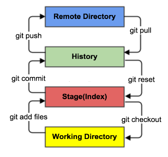

# 公司平时所学

​		主要是为了记录一些平时看到结果和学到的trick

#### 梯度消失和梯度爆炸

​		越靠近输入层的参数更新的越慢，只有靠近输出层的参数在更新

## 2020.7.15

​		今天继续做胸椎十二点定位，张研究员已经通过修改了部分结构，将图像做了一个池化处理，图像的size变为原来的四分之一，然后这样高斯核的loss就会占比更大，使用的MSEloss也会在反向传播中更好的得到更新。他给我的任务是在四块GPU上面进行测试，测试不同大小的输入对结果的影响。当然对于更小的输入的图片训练和预测也会更快，所以我们要在保证效果的情况下以更小的图片size进行训练。

#### 重新生成数据

​		先生成不同大小，且mask被高斯核占满的heatmap。同时要观察resize之后是不是仍然保留四个像素

## 2020.7.16

#### 查看pid详细信息

ps  -u -p pid

#### nohup ... &

nohup: appending output to 'nohup.out'

上面这句话应该是该程序已经加入后台了，这时候如果程序出错的话，那就不会不运行。

但是终端所有的信息都会被保存到当前文件夹下一个nohup.out的文件

## 2020.7.22

### 通过ssh远程连接服务器

#### pycharm

在tools里面打开deployment，选择configuration进行设置。然后配置ssh连接的端口号，然后在mappings中进行映射就能在本地和服务器之间文件互传了。

#### VS Code

需要先下载Remote SSH 和Remote SSH：Extension，然后在出现的里面设置远程连接。然后对config文件进行设置，其中Host是名字，Host那么是服务器的ip地址，Port是端口号，User是用户。

#### 注意事项

在ssh通过映射之后还是没有可视化的，唯一的方便之处就是有了pycharm和vscode这样的ide可以直接调试项目的bug和环境。

### Github使用指南

git add 到缓冲区，这时候可以通过git status（-s)来查看状态，也可以mv，clean修改状态

git commit 将缓冲区的文件提交到本地厂库

## 2020.7.23

tensorboard  --logdir=./path/

然后再浏览器中输入10.100.37.5:30062（其中：前面的是服务器ip，30062是杨帆docker映射的tensorboard端口）

其中要回到path的上一级进行输入，杨华的docker可能是tensorboard有问题导致看不了，但是张凡的可以看。

tensorboard会自动搜索文件夹下面所有的相关文件，包括子文件夹里面的东西

## 2020.8.6

https://www.cnblogs.com/qiuniao/p/12023704.html这个网址是pycharm professional的免费激活方法

GPU上某些进程杀不死，查了一下说是因为父进程虽然kill了，但是子进程的内存还没有释放。通过  ps -ef|grep 进程ID  ，来查找其父进程。然后再使用    kill -9 父进程ID  来杀死。详情请见博客https://blog.csdn.net/geter_CS/article/details/87287062

## 2020.8.7

tail -f nohup.out 实时查看用nohup ... &的输出，如果报错的话会调出最后出错的信息

jupyter notebook使用指南，我们不需要对file一直upload，我们直接cd进入我们想要打开的文件夹，然后再终端里面输入jupyter notebook命令就能打开自己想打开的文件夹了，同时那些程序的运行默认位置还是源文件的位置。

## 2020.8.11

**ls -l |grep ^- |wc -l** 统计文件夹下面文件数量

原理就是ls -l显示所有信息，其中文件信息的字符串第一个是-，所有后面统计-的数量

只要把-改为b就成了统计文件夹的数量

## 2020.8.14

unsigned:无符号的

在c++中一般int或者char默认是有符号的（就是包含正负）

char - short int - int - long int分别是1，2，4，8个字节（一个字节Byte是8位）

float 8 个字节

namespace:命名空间，c语言允许不同的命名空间的标识符同名而不发生冲突

可以自己定义命名空间namespce gaojingsheng{......}

std就是定义了所有标准库里面标志符的命名空间

## 2020.8.20

lambda 相当于简单版本的def，：前面是输入变量，后面是返回值

## 2020.8.25

map(function,iterable)对迭代器统一做function变换，比如变为str。

join 是以某连接符将序列中的元素连起来，直接连起来就是 "".join(list...)

