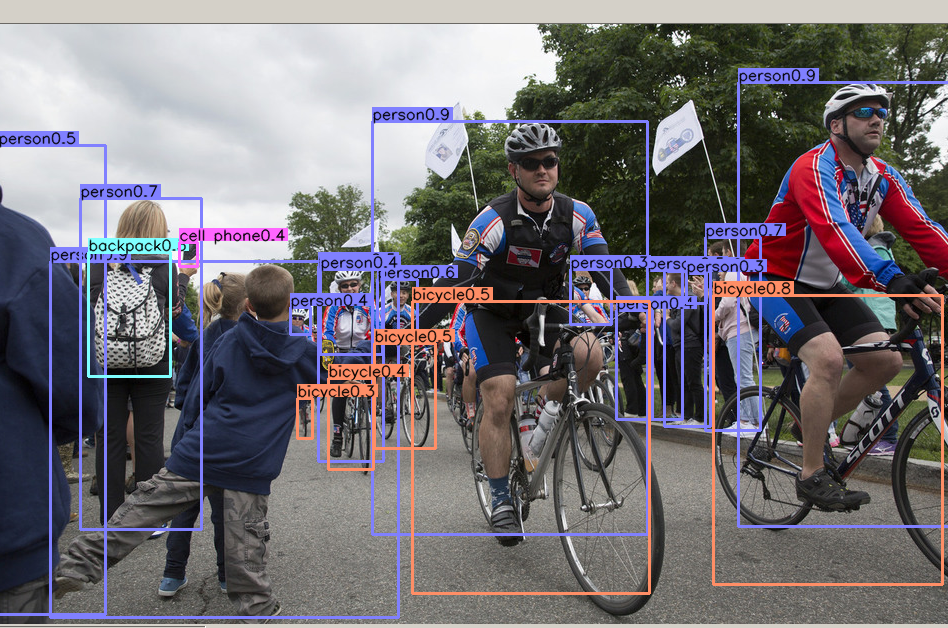
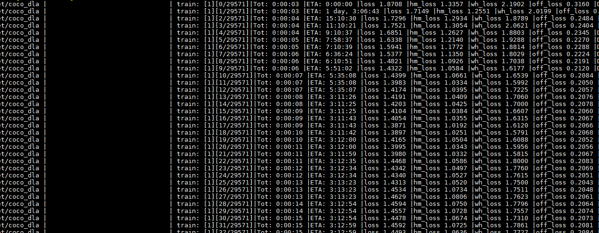

# 从零开始复现CenterNet

## 准备数据集

### COCO数据集

#### Demo测试

目前为止有语义分割的最大数据集，提供的类别有80 类，有超过33 万张图片，其中20 万张有标注，整个数据集中个体的数目超过150 万个。

python test.py ctdet --exp_id coco_dla --keep_res --load_model ../models/ctdet_coco_dla_2x.pth

#### 目前训练

CUDA_VISIBLE_DEVICES=6 nohup python main.py ctdet --exp_id coco_dla --batch_size 4 --master_batch 15 --lr 1.25e-4  --gpus 6 &

然后训练完成

#### 测试

python test.py ctdet --exp_id coco_dla  --load_model ../exp/ctdet/coco_dla/model_best.pth

#### 单张图片测试

可以发现单张图片虽然检测出来了大部分，但是置信度比原文低很多

### Pascal VOC数据集

首先在tools文件夹中bash get_pascal_voc.sh

http://host.robots.ox.ac.uk/pascal/VOC/voc2012/VOCtrainval_11-May-2012.tar

http://host.robots.ox.ac.uk/pascal/VOC/voc2012/VOCdevkit_18-May-2011.tar

### KITTI数据集

## 代码细节

#### openpose和centernet的差异

##### openpose

先用vgg-19进行特征提取，找到关节的heatmap，然后提取热图中关节具体的位置。找到肢体连接，然后拼装肢体形成人

上图就是神经网络预测的关节点

然后找到肢体，如上图

将腿连起来

将肢体拼成人

##### centernet检测人体姿态

令中心点是k*2维的（coco数据集中人体有k个关节，其中k=17）（所以相当于把所有的关节点看成一个center point），回归出每个关节点相对于中心点的偏移。给loss添加mask来无视那些看不到的关节点。然后就用openpose类似的方法估计人体关节点的热力图，然后将中心偏移的损失分配给最近的关节点。后面将关节点连成人体的方法就没讲，但是猜测和openpose类似。

#### 训练结果的差异，loss的差异

上面的差异除了GPU差异之外还有就是左边的模型是2x，训练的epochs是210，右边的是1x，epochs是140。

hm_loss就是中心点的loss，也对应论文中的L_k。2.124

off_loss就是缩放时偏移的loss，也对应论文中的L_off。0.231

wh_oss就是边长的loss，也对应论文中的L_size。4.203

加权后总loss为2.78

直接导入模型训练结果如上图所示，print出来的loss是单张图片的loss，（自己没明白的是，为什么导入同一个模型，然后在不同的batchsize下进行训练的初始loss都不同）

稍微稳定一点后hm_loss为1.1，wh_loss为1.6，off_loss为0.20，总loss为1.4

在tensorboard经过一个epoch后

