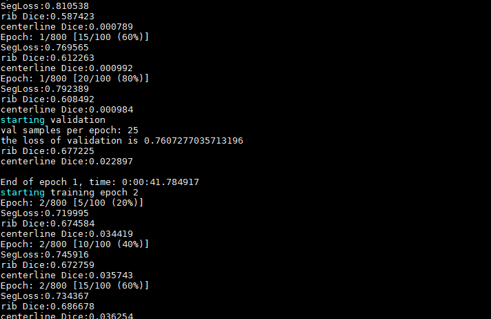

# 肋骨（RIB）分割项目

## 工作目标

1、分辨率

目前是256，然后对比做更大的比如320，448之类的

crop:裁剪过后的图像

ori:origin图像

res:分辨率 0和1分别代表原始分辨率，1代表1mm分辨率

目前先用crop 256 和 320进行训练，同时增大channel做twostage的实验

2、网络的channel和深度，目前是初始8channel，对比3，4，5采样次数

3、更复杂的网络

 multiresunet、nestedunet(主要)

4、数据路径：/fileser/CT_RIB/data/

image是原始图像，mask是标注，mask_centerline(标注了肋骨和中心线)

## 环境搭建

Cisco远程服务器上面anaconda已经下载好了

新建环境conda create -n rib python=3.6

如果在新环境里面torch下载过慢的话，考虑在torch1.5的环境里面进行实现

## 评价指标

## 训练过程

通过自己再一次分割训练集和验证集，开始训练twoStage的情况

