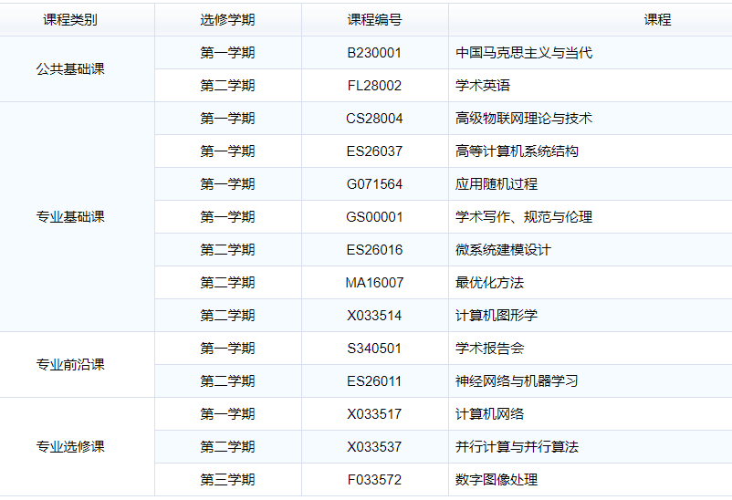

# 计算机科学与技术博士培养计划选课

## 最低总学分：40分（相对于上一届35分略有增加）

先看一下冉苇课表

## 选课方案：公共基础课+专业基础课+专业前沿课+专业选修课

### 公共基础课（全为必修）总共6学分

第一学期：学术写作、规范与伦理（1学分）

自然辩证法概论（1学分）

中国马克思主义与当代（2学分）

第二学期：学术英语（2学分）

## 专业基础课（数学类）必修总共15学分共五门，均为三学分（实际上是只用修一门+）

**应用随机过程（第一学期）**，剩下四门都是一二学期均可

**计算方法、矩阵理论、最优化方法、基础数理统计**

总共6+15+2（后面一门第二学期的学术报告研讨会必修）

**23学分必修课**

## 剩下学分选课排序

高等计算机系统结构（实验室要求必修）3学分、第一学期

根据未来规划：下面为**优先选课** 加上实验室要求共13学分

神经网络理论与应用——3学分、第二学期

机器学习——3学分、、第二学期

数字图像处理——2学分、第一学期

并行计算与并行算法——2学分、第二学期

算法分析与理论（提高算法水平可考虑）第二学期 3学分

下面为**剩余可选课程**

如果前面课全部选上，一般再加**两门课**就行

统计学习与推理（一些统计指标，对机器学习有帮助） 第一学期 3学分

计算机图形学（处理图像方面，可能会有较多编程）第二学期 3学分

自然语言理解（深度学习也得了解NLP）第二学期 2学分

类脑智能（不知道是啥，看名字）第一学期 3学分

也可以选大数据方面的算法或处理（但是不知道什么语言）

